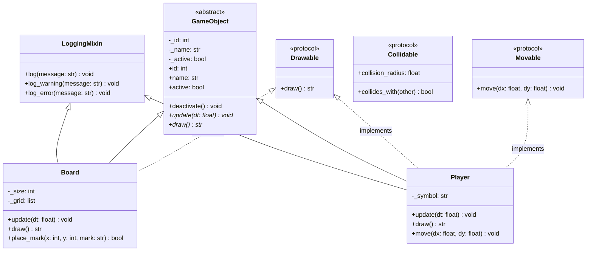

# Архитектурная модель: Модуль 2

## UML-диаграмма классов

## Ответы на вопросы проектирования

1. **Почему `GameObject` - это ABC, а не Protocol?**
   `GameObject` задает фундаментальную сущность (<чем объект является>) и содержит общее состояние и реализацию: инкремент `_id`, хранение имени `_name`, флага активности `_active` и метод `deactivate()`. Протоколы не должны навязывать конкретную базовую реализацию состояния.
2. **Почему `Movable` - это Protocol, а не ABC?**
   `Movable` определяет исключительно роль/поведение (<что объект умеет делать>). Использование протокола позволяет проверять поддержку перемещения через структурную типизацию (<утиная типизация>) без жесткой привязки к дереву наследования.
3. **Какие классы реализуют несколько протоколов одновременно?**
   Класс `Player` реализует одновременно `Drawable` (может отображаться в интерфейсе со своим символом и статистикой) и `Movable` (выполняет ход с изменением координат).
4. **Какие классы не должны наследоваться от `GameObject`?**
   Классы `UI`, `Game` (оркестратор игрового процесса) и конфигурационные датаклассы (`GameConfig`, `PlayerConfig`). Они не являются объектами игрового мира, а представляют собой внешние сервисы и структуры данных.
